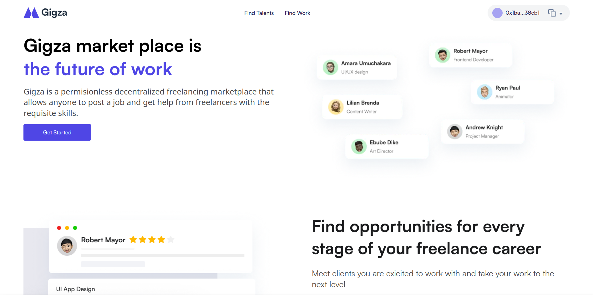

## Gigza - A Decentralized Freelancing Marketplace

### Live Demo - [https://gigza-app.vercel.app](https://gigza-app.vercel.app)

### Tech Stack of Gigza
* Solidity
* Next.js
* Tailwind CSS
* React
* Hardhat
* Evmos

### The Use of Gigza
Gigza is a permissionless freelancing marketplace that connects clients (anyone with a project or problem) to skilled freelancers (problem solvers).

### Brief Description of Gigza
Gigza is a permissionless decentralized freelancing marketplace that allows anyone to post a job and get help from freelancers with the requisite skills. Freelancers can also earn a living regardless of where they may be situated and their access to bank services by bidding and executing client jobs. The smart contract acts as the escrow account replacing the need for an intermediary.

### Inspiration
We were inspired to build Gigza, a decentralized freelancing marketplace because we firmly believe that for Web3 to gain true adoption it needs to power real-world business use cases. As freelancers on traditional Web2 platforms, we understand the pain points such as the high service fee paid to the marketplace, in many cases a whopping 20% of revenue, the gated approach to approving freelancers before they can participate, the hassle of transferring funds earned to a local currency and bank account, the threat of countrywide bans, etc. and we also know that Web3 technologies can address most of those challenges. We, therefore, decided to take on this challenge by building a Web3 native freelancing platform/marketplace.

### How I Built It
Gigza was built using smart contracts on Evmos, React for the frontend through Next.js, and access is via a non-custodial wallet like Metamask.

### Challenges I Ran Into
The main challenge was the viability of creating a messaging platform to aid communication between clients and freelancers. The other challenge was the problem of arbitration on the platform which is currently based on the intervention of a human operator.

### What I Learned
We learned that the efficiency of Evmos because of the low gas fees and Proof of Stake (PoS) consensus allows for an application like this to be built. It allowed the design of the platform to leverage cheap on-chain interactions.

### Value Proposition of Gigza
* Permissionless access to the platform for both clients and freelancers.
* Reduced commission fee for freelancers (2%) compared to 20% of Web2 competitors.
* Easy access to monies earned through a relatively decentralized stablecoin - DAI.
* Clients in jurisdictions with Foreign Exchange (FX) fiat limits on their bank cards can fund larger scale projects through cryptocurrency and Gigza.

### Testing the Demo dApp
* Go to the demo URL - [https://gigza-evmos-hackathon.vercel.app](https://gigza-evmos-hackathon.vercel.app)
* Login with your non-custodial wallet e.g Metamask via the `Get Started` button.
* Click on `Find Work`.
* Bid for a job as a freelancer.
* To create a job post as a client, you must have the dummy DAI token, to pay for the job.
* Go to the dummy DAI token contract on Evmos (Mainnet) - 0x3edb7b1d57b1dDE14D4f6327a4e55ac40F43A3B1
* Use the mint function, this will send 1000 Dummy DAI tokens to your wallet.
* Click on `Post a Job` on Gigza and fill in the details.
* You can create or update your profile on the profile page. Click on your the dropdown icon by your Evmos address at the top right-hand corner to go to the profile page.

### Deployed Contracts (Evmos Mainnet)
Gigza - 0x898bF0B5657FFEC66d0E658943Ed2df6e2652D14

Dummy DAI Token - 0x3edb7b1d57b1dDE14D4f6327a4e55ac40F43A3B1

### What's Next for Gigza
We intend to continue to build out the product and spun it into a full-fledged startup as we believe a Web3 freelancing platform can be transformational and capture good market share in this era of remote work. To that end, we intend to raise funding going forward.

### License - GPLv3
This project is licensed under GPLv3
[Link to license](https://github.com/bralnapp/gigza-evmos-hackathon/blob/main/gpl-3.0.txt)

